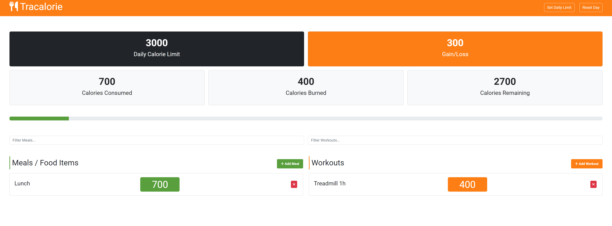

# Tracalorie App (OOP Project)

This is project where I'm using OOP classes that will track calories based on meals and workouts.

I will implement local storage as well

- Base Tracker, Meal & Workout Class

- Display Tracker Stats

- Progress Bar & Calorie Alert

- App Class, New Meal & Workout

- Refactor to Single \_newItem Method

- Display New Meal & Workout

- Remove Meal & Workout

- Filter & Reset

- Set Calorie Limit

- Storage Class & Calorie Limit Persist

- Persist Total Calories To Local Storage

- Save Meals To Local Storage

- Save Workouts To Local Storage

- Remove Meals & Workouts From LocalStorage

- Clear Storage Items

